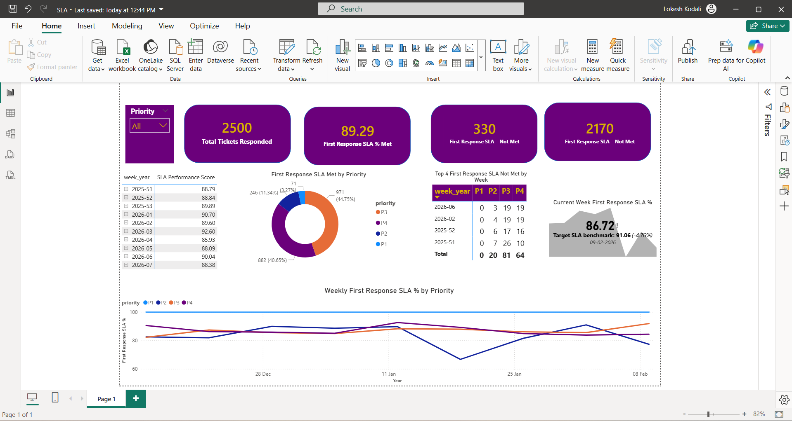

# Service Desk SLA Trend Dashboard (Synthetic Data)

## Overview
This project calculates SLA performance metrics using MySQL and visualizes weekly trends in Power BI.

## Problem
Teams often track SLA without consistent definitions. This project focuses on correct SLA logic, eligibility rules, and trend reporting.

## Data
Synthetic dataset (no real customer data).
- tickets.csv
- agents.csv
- sla_policies.csv

## Metrics
- First Response SLA % (by priority)
- Resolution SLA % (resolved only)
- Backlog count
- Backlog aging buckets
- Weekly First Response SLA trend

## Tools
- MySQL (SQL logic + validation)
- Power BI (dashboard)

## Dashboard

## How to Run
1. Load CSVs into MySQL (or connect to your DB)
2. Run SQL scripts in `/sql`
3. Use results to build Power BI visuals
